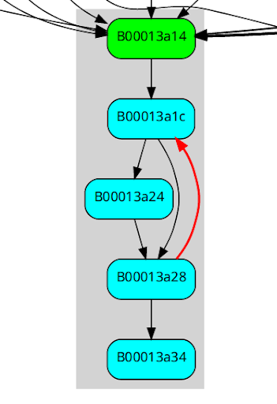
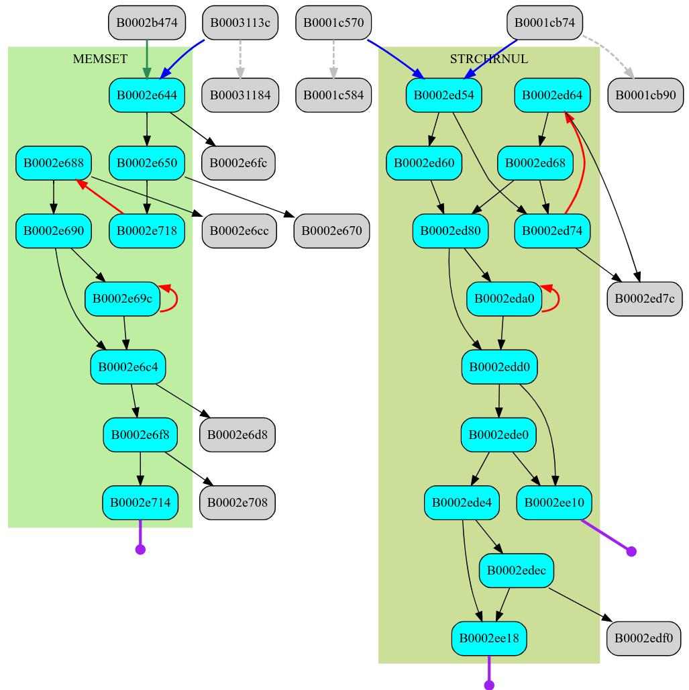
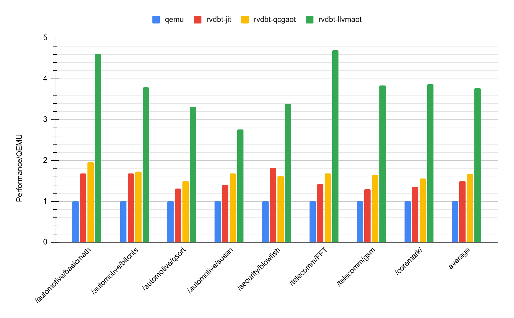

# rvdbt
---
_rvdbt_ is tiny proof-of-concept `riscv32i` to `amd64` usermode binary translator. _rvdbt_ achieves relatively high perfromance combining two translation tiers - lightweight dynamic translator and profile-guided static translator. _rvdbt_ design is focused on modularity, both for guest ISA and particular backends, such as LLVM-based AOT compiler.

## Overview
---
Project structure:
* `/*`: core execution logic, memory mappings, linux syscall proxies
* `/qmc`: _QuickIR_ and lightweight compiler
	* `/qmc/qcg`: _QuickCodegen_ and common runtime stubs
	* `/qmc/llvmgen`: _QuickIR_ to _LLVM IR_ convertor, intrinsic expansion passes
* `/guest`: riscv ISA, translation frontend, interpreter and stubs
* `/tcache`: translation cache and execution profile manager
* `/aot`: static binary translation profile analyser and `.aot.so` file format

## Execution flow
---
_rvdbt_ combines DBT and SBT, using the former as the default fallback for newly detected regions and unusual branch targets. DBT and `tcache` components gather necessary info for SBT binary analysis framework.  
General workflow may be represented with `elfrun` and `elfaot` tools usage:
1. `elfrun` boots `.elf` and executes it for a first time in dynamic mode and records profile `.prof` in internal file storage
2. `elfaot` analyses `.prof` and produces `.aot.so`
3. `elfrun` boots `.elf`, preloads `.aot.so` code, if unusual code path is met uses dynamic translation and records `.prof` changes
4. goto step `2.`

## QuickIR
---
_QuickIR_ is lightweight non-SSA internal representation of _QMC_ compiler. _QuickIR_ operates on _local_ and _global_ states, former represent optimized temporaries and the rest include both emulated CPU state and any internal data structures attached to _CPUState_, which is a common concept of many other emulators. _local_ and _global_ terms are also applied to controlflow, global branch instructions _gbr_ and _gbrind_ handle emulated branches which escape current translation region.  
If a particular instruction or its slowpath can not be represented in _QuickIR_ then a special _hcall_ may be used to invoke a pre-registered guest runtime stub. Stubs are also generated from interpreter handlers, thus it is always easy to extend translated ISA avoiding mandatory frontend support for new instructions.

---
_QuickIR_ sample (1) - single basic block
```
00018c40:  slli   s2, s2, 8
00018c44:  or     s2, s2, s3
00018c48:  addi   s3, zr, 61
00018c4c:  jal    zr, 12
```
```
bb.0: succs[ ] preds[ ]
        #0 sll [@s2|i32] [@s2|i32] [$8|i32]
        #1 or  [@s2|i32] [@s2|i32] [@s3|i32]
        #3 mov [@s3|i32] [$3d|i32]
        #4 gbr [$18c58|i32]
```
---
_QuickIR_ sample (2) - conditional branch representation
```
00018fc0:  lw     a5, a1, 0
00018fc4:  sw     zr, a1, 4
00018fc8:  addi   a6, a1, 0
00018fcc:  beq    a5, zr, 132
```
```
bb.0: succs[ 2 1 ] preds[ ]
	#0 mov [g:80|i32] [$18fc0|i32]
	#1 vmload:i32:s [@a5|i32] [@a1|i32]
        #2 mov [g:80|i32] [$18fc4|i32]
        #3 add [%32|i32] [@a1|i32] [$4|i32]
        #4 vmstore:i32:u [%32|i32] [$0|i32]
        #6 mov [@a6|i32] [@a1|i32]
        #9 brcc:eq [@a5|i32] [$0|i32]
bb.1: succs[ ] preds[ 0 ]
        #7 gbr [$18fd0|i32]
bb.2: succs[ ] preds[ 0 ]
        #8 gbr [$19050|i32]
```
* `g:80` - program counter location in global `CPUState`, manually flushed by frontend before translating "unsafe" `vmload` instruction  
* `%32` - temporary local register, frontend may emit an arbitrary number of locals in a single region

---
### QuickCodeGen
---
_QuickCodeGen_ is a simple and fast codegen for _QuickIR_, which is split in three passes:
* `QSel`: lowers too complicated `QuickIR` instructions according to target ISA constraints
* `QRegAlloc`: simple single-pass register allocator. Puts much effort to avoid global state synchronization like well-known binary translators
* `QEmit`: emit host ISA instructions, hand-coded in `asmjit`
  
_QuickCodeGen_ works mostly with `ArchTraits` namespace, which includes
* Host registers sets, fixed _QuickCodeGen_ calling convention regs
* Tightly-encoded host ISA instruction constraints

Several internal calling convention stubs are hand-coded in host assembly in `jitabi.cpp`

### Calling convention
---
_rvdbt_ implements well-known block chaining and introduces an optimized calling convention for different branch types and backends, assisting code profiling and allowing a simultaneous execution of qcg- and llvm- translation fragments.  
Some registers are fixed and preserved throughout fragments:
* `state` - guest cpu thread state
* `membase` - guest virtual memory base (=0 in default configuration)
* `sp` - host stack pointer
The rest are considered clobbered thus always available for local register allocator.

Call stack can not be safely emulated in general scenario, so it is not emulated and branches between emulated regions are always tailcalls. _QCG_ avoids creation of local stack frame in each fragment. Instead while _QCG_ fragment code is executed there is always a fixed-size `spillframe` allocated. Fragments without runtime calls (effectively leafs) have no prologue/epilogue handling code, the rest may contain a single instruction to satisfy host stack alignment requirements.
Chaining is implemented via `BranchSlot` patchpoints. `BranchSlot` is a tiny struct inserted at branching code right in translated fragment code. Slot layout is the following:
```
	union { JumpPatch; CallPatch; ... }; // encoded terminator
	ip;                                  // guest target pc
	flags;                               // profiling flags
```
`BranchSlot` can be always set to jump to another translated fragment or call any runtime stub. Those stubs follow qcg calling convention. If stub leads to c++ execution then it's responsible for calling convention differences handling.
`CallPatch` involves host call instruction sequence, produced return address is used by stub code to obtain caller `BranchSlot` location to re-patch it or to record profiling feedback.  
The main runtime stubs are:
1. `stub_link_branch_jit`, `stub_link_branch_aot` - lazy fragment linking stubs, translator uses these to translate `gbr` instruction. _Link_ stubs perform lookup in translation cache, if a fragment found then `JumpPatch` is placed into `BranchSlot` to chain blocks, in other case execution stack is unwinded up to main `Execute` loop with branch destination forwarded. New chain links are announced to `tcache`, so some profile data is recorded.  
2. `stub_brind` - slowpath of indirect branch resolution of `gbrind` instruction. Stub performs full lookup in translation cache and announces indirect jump to `tcache`. Announcement involves updating specialized lookup table entry. Fastpath action of `gbrind` is relatively simple
```
        lea edi, [rsi*4]
        and edi, 0xfff0
        cmp dword [rdx + rdi], esi
        jne <on_miss>
        jmp qword [rdx + rdi + 8]
```
3. `escape*` stubs - unwind execution up to main `Execute` loop. Used as `branch` and `brind` return destination on translation cache miss.

`trampoline_to_jit` is a general trampoline to translated code. It saves clobbered regs, sets up _QCG_ frame, then jumps to fragment entry.

Described calling convention and used fixed register mappings satisfy GHC calling convention, so llvm- and qcg- processed translation units are internally aligned.

### Profiling and SBT region formation
---
Several discussed `BranchSlot` slowpath sites and the rest `tcache`-related code are used to record information about executed binary file. The profile records addresses of all executed blocks, additionally marking those which are cross-page branch targets or indirect branch targets.  
`.prof` file is loaded at the `.elf` boot and updated when particular page is unmapped or invalidated. `elfaot` tool uses recorded blocks as graph nodes and scans instructions from the associated address up to the nearest branch instruction, other recorded block, page boundary or stops at basic block size limit. An edge is build to the each possible successor found in graph.
rvdbt uses its own translation regions building algorightm constrained with two requirements:
1. Every region has a single entrypoint. For each block in region on each possible execution path according to profile the last visited entrypoint must belong to this block's region.
2. Number of regions in graph must be minimal.

We consider indirect and cross-page branch targes as region entrypoints, and it's also obvious that there are other entrypoints. Consider a graph of nodes _{A, B, C}_ and edges _{A->C, B->C}_, where _A_ and _B_ were marked as region entrypoints. There are two different path to _C_ where different entypoints are leading, thus _C_ is also an entrypoint. It's quite easy to show that entrypoints can be selected as _phi_ nodes in _minimal SSA_ construction algorithm. rvdbt implements it as it was described in intial works.  
Here are a few examples with nodes grouped in regions in grey rectangles and colored as listed:
* orange - indirect branch targets
* green - cross-page branch targets
* purple - infered entrypoints
* cyan - the rest executed nodes
* grey - referenced, but never executed

---
`__mulsi3` integer multiplication stub from `libgcc` for `rv32i`
```
__mulsi3
; arg int32_t arg1 @ a0
; arg int32_t arg2 @ a1
0x00013a14      mv a2, a0
0x00013a18      li a0, 0
0x00013a1c      andi a3, a1, 1
0x00013a20      beqz a3, 0x13a28
0x00013a24      add a0, a0, a2
0x00013a28      srli a1, a1, 0x1
0x00013a2c      slli a2, a2, 0x1
0x00013a30      bnez a1, 0x13a1c
0x00013a34      ret
```


---
A part of `libc` code split into regions


---
`memset` and `strchrnul`



---
`memcpy` has a `switch-case` block to make copied data size aligned, so a strange pattern appears in graph


### LLVM-based backend
---
`QuickIR` is translated into `LLVM IR` with `LLVMGen` backend, which is an alternative to `QuickCodeGen` described previously. In short:
* `QuickIR` region is mapped into `LLVM` `Function`, `BasicBlock` into `BasicBlock`
* Fixed registers are converted into `Function` parameters, `Function`s use `ghccc` calling convetion
* _global_ and _local_ registers defs and uses are replaced with `load`s and `store`s, which are later _promoted_ with LLVM optimization passes
* _local_ registers enumerated with `alloca`s in entry `BasicBlock`, _global_ registers listed using `getelementptr`s linked to `state` value
* `gbr` and `gbrind` branch instructions replaced with tailcalls to dummy functions `intr_gbr` and `intr_gbrind`

`LLVMGen` attaches _AliasAnalysis_ metadata to each `load` and `store` generated to show LLVM's _DeadStoreElimination_ pass different memory locations that do not intersect. For example, if there is a store into emulated memory between two reads of single emulated register, the last read may be eliminated because _state_ and _memory_ alias partitions do not intersect.

During the LLVM optimization passes, some indirect branch targets might become statically known. For example, if a tiny procedure is inlined, llvm may replace an input of return instruction (initially riscv `jalr` and _QuickIR_ `gbrind`) with constant.
```
        mov rax, qword [r13 + 0x88]       # cache loaded
        cmp dword [rax + 0x2590], 0x10964 # check if cached address matches
   ┌──< jne 0x818a                        #  but llvm has already computed actual location
   │    mov rax, qword [rax + 0x2598]
   │    pop rcx
   │    jmp rax
   │    ....
   └──> mov rdi, r13
        mov esi, 0x10964
        call qword [r13 + 0xb8]
        pop rcx
        jmp rax
```
`LLVMGen` registers `intr_gbr` and `intr_gbrind` functions and uses them to translate `gbr` and `gbribd`, then optionally lowers them in additional `ExpandIntrinsics` pass, optionally replacing
* `intr_gbrind` with `intr_gbr`, if destination is constant
* `intr_gbr` with llvm `call tail` to known region's `Function`

LLVM is also capable of merging `intr_gbr` calls with a single destination. The same feature is disabled for `intr_gbrind` as it may merge two optimizable callsites into one with unknown branch target.
Before codegen all remaining `intr_gbr` sites are replaced with `BranchSlot`s encoded with llvm `InlineAsm`. `intr_gbrind` fastpath is encoded in LLVM directly, and the same QCG slowpath stub is used.
Resulting file is linked into `.aot.so` and a special `.aottab` section is added for fast load into `tcache`.

### Results
---
Benchmarks: CoreMark and `MiBench` embedded benchmarks set  
Compiled with `gcc` for `rv32i ilp32` with `-O2`, static linking  
Host CPU: Intel(R) Core(TM) i5-6200U  


